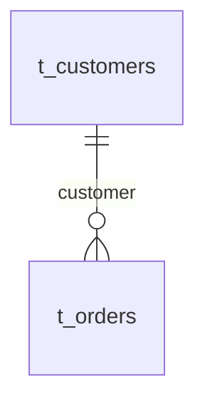

# @powerduck/datamodel

> Browser-safe relational modeling core for OpenAPI. Turn an OpenAPI document into entities, foreign keys, dialect-aware DDL, an ER graph, a table ↔ API impact index, and a versioned, AI-ready reconciliation artifact — with **pure functions only, zero runtime dependencies, and no React, DOM, filesystem, or network access**.

Part of the [Powerduck](https://www.powerduck.com/) toolkit.
Website: **[powerduck.com](https://www.powerduck.com/)** · Docs: **[powerduck.com/docs/getting-started/introduction](https://www.powerduck.com/docs/getting-started/introduction)** · npm: **[@powerduck/datamodel](https://www.npmjs.com/package/@powerduck/datamodel)**

---

## What it does

Given an OpenAPI 3.x document, this library:

1. **Extracts relational entities** from component schemas and inline request/response bodies, resolving `$ref`, `allOf`, `oneOf`/`anyOf`, and pagination envelopes.
2. **Infers foreign keys deterministically** from object properties whose value is a component `$ref`.
3. **Derives many-to-many link tables** from plural array-of-`$ref` properties (e.g. `User.products: Product[]`) and constrains explicit associative (join) schemas with composite primary/unique keys.
4. **Generates DDL, indexes, deterministic seed data, and deployment scripts** for MySQL, SQL Server, and Oracle.
5. **Diffs a model against a live database** (read-only introspection input) and emits **additive-only** `CREATE`/`ALTER` SQL.
6. **Builds a unified ER graph** that merges modeled relationships with real, enforced foreign keys, classifying every table as `matched`, `drift`, `missing`, or `extra`.
7. **Builds a reverse impact index** mapping each schema/table to every API operation that references it (including nested, transitive references).
8. **Produces a single versioned reconciliation artifact** (`buildReconciliation`) consumable by both humans and AI, exportable as canonical JSON or Markdown with an embedded Mermaid `erDiagram`.

It generates SQL and plans **but never executes anything** — there is no database driver in this package.

## Why a package

The same deterministic result powers three surfaces from one source of truth:

- **Humans**: a react-flow ER diagram and a Markdown brief that renders in Git/PRs.
- **The built-in AI chat**: read-only host tools grounded in exact table/column/operation facts.
- **External AI coding tools and MCP clients**: the self-contained JSON artifact, so an AI plans a migration from facts instead of guessing.

## Installation

```bash
npm install @powerduck/datamodel
```

The package ships dual ESM/CJS builds with bundled TypeScript declarations and works in the browser, Node, and Electron renderers.

## Quick start — forward engineering

When no database exists yet, generate every table, relationship, and an ordered migration plan straight from the spec:

```ts
import { readFileSync } from "node:fs";
import {
  buildReconciliation,
  exportReconciliationJson,
  exportReconciliationMarkdown,
} from "@powerduck/datamodel";

const doc = JSON.parse(readFileSync("openapi.json", "utf8"));

const report = buildReconciliation({
  doc,
  dialectId: "mysql", // "mysql" | "sqlserver" | "oracle" (default "mysql")
  specDigest: "sha256:...", // optional, echoed back verbatim
});

// Canonical machine/AI contract
const json = exportReconciliationJson(report);

// Human brief with an embedded Mermaid erDiagram and the migration plan
const markdown = exportReconciliationMarkdown(report);
```

The report's `migrationPlan` orders `CREATE TABLE` steps by foreign-key dependency (parents first) and records `blockedBy` step numbers, so the generated script always applies in a valid order.

## Reconciling against a live database

Pass introspected tables and foreign keys (collected by your own read-only driver) to compare the model with what actually exists:

```ts
import { buildReconciliation } from "@powerduck/datamodel";

const liveTables = [
  {
    name: "customers",
    columns: [
      { name: "id", dataType: "bigint", nullable: false, isPrimaryKey: true },
      { name: "name", dataType: "varchar(100)", nullable: false },
      { name: "email", dataType: "varchar(255)", nullable: false },
    ],
  },
  {
    name: "orders",
    columns: [
      { name: "id", dataType: "bigint", nullable: false, isPrimaryKey: true },
      { name: "customer", dataType: "bigint", nullable: false },
      { name: "total", dataType: "decimal(18,4)", nullable: false },
      { name: "status", dataType: "varchar(20)", nullable: false },
    ],
  },
];

const liveForeignKeys = [
  { table: "orders", column: "customer", refTable: "customers", refColumn: "id" },
];

const report = buildReconciliation({
  doc,
  dialectId: "mysql",
  liveTables,
  liveForeignKeys,
  database: { name: "prod", host: "10.0.0.1", database: "shop" },
});

console.log(report.summary);
// { matched: 2, drift: 0, missing: 0, extra: 0,
//   relationships: 1, enforcedRelationships: 1, unenforcedRelationships: 0, ... }
```

Table statuses:

| Status | Meaning |
| --- | --- |
| `missing` | Modeled in the spec, absent from the live database (forward engineer it). |
| `matched` | Present live and compatible with the model. |
| `drift` | Present live but a column is missing or a type/nullability differs. |
| `extra` | Exists live but has no corresponding model entity (an orphan to review). |

Modeled relationships that are not enforced by a real foreign key are surfaced as `unenforcedRelationships` and an open question; live-only foreign keys appear with origin `live`.

## ER graph and Mermaid

```ts
import { extractEntities, buildGraph, buildMermaidErDiagram } from "@powerduck/datamodel";

const entities = extractEntities(doc);
const graph = buildGraph(entities, { dialectId: "mysql", liveTables, liveForeignKeys });

graph.nodes;        // tables with modeled/live columns, status, and diffs
graph.relationships; // from/to table+column, origin (model|live|both), enforced, confidence

const mermaid = buildMermaidErDiagram(report);
```



Large diagrams are capped deterministically (`MAX_MERMAID_TABLES`, `MAX_MERMAID_COLUMNS`) with explicit `omitted` notes rather than failing.

## Table ↔ API impact index

Find every operation affected when a table changes, including transitive references (an operation returning `Order` also depends on `Order.customer` → `Customer`):

```ts
import { buildImpactIndex, operationsForEntity, extractEntities } from "@powerduck/datamodel";

const index = buildImpactIndex(doc);
index.schemaUsages.Customer; // [{ ref: "POST /orders", location: "request", schema: "Customer" }, ...]
index.operations;            // every "METHOD /path", sorted

const customer = extractEntities(doc).find((e) => e.name === "Customer");
operationsForEntity(customer, index); // ["GET /customers", "POST /orders", ...]
```

## Lower-level SQL APIs

```ts
import {
  extractEntities,
  buildAllDdl,
  buildDeploymentScript,
  buildSampleData,
  buildInsertStatements,
  diffEntityAgainstLive,
  buildAlterScript,
} from "@powerduck/datamodel";

const entities = extractEntities(doc);

// All CREATE TABLE statements (topologically ordered) plus skipped cyclic FKs
const { statements, skippedForeignKeys } = buildAllDdl("mysql", entities, { ifNotExists: true });

// Full deployment script: tables + indexes + deterministic seed rows.
// Returns { sql, tableCount, indexCount, insertRowCount, skippedForeignKeys }.
const deployment = buildDeploymentScript("mysql", entities, {
  ifNotExists: true,
  sampleRows: 5,
});
console.log(deployment.sql);

// Deterministic sample rows for one entity: { columns: SampleTableColumn[], rows: SampleCell[][] }
const sample = buildSampleData(entity, 3);

// Seed INSERTs for every entity, topologically ordered.
// Returns { statements, sql, rowCount }; count is clamped to 1..20.
const inserts = buildInsertStatements("mysql", entities, 3);

// Compare one entity to a live table and generate additive ALTER SQL
const diff = diffEntityAgainstLive("mysql", entity, liveTable); // status + actionable items
const alter = buildAlterScript("mysql", entity, liveTable, entities); // string[] of statements
```

### Reverse engineering live tables into components

```ts
import {
  selectableColumns,
  buildComponentSchema,
  planComponentPatch,
} from "@powerduck/datamodel";

// Choose the live columns to reverse-engineer, then build the component schema.
// The component name is supplied when planning the patch; the physical table is
// recorded inside the schema as x-table-name.
const selected = selectableColumns(liveTable).map((column) => column.name);
const schema = buildComponentSchema(liveTable, selected);
const plan = planComponentPatch(doc, "Order", schema); // non-destructive JSON Patch merge
// plan.ops is empty when nothing new is needed; plan.empty === true
```

## The reconciliation artifact

`buildReconciliation` returns a versioned, self-contained object (`RECONCILIATION_SCHEMA_VERSION`, currently `1.0.0`):

- `source` — spec metadata (title, version, digest, operation count) and connected-database metadata.
- `summary` — entity/table/relationship counts, status totals, enforced vs. unenforced relationships.
- `tables[]` — per-table status, modeled/live column pairs, composite primary key (associative tables), relationships, diffs, impacted operations, and proposed additive SQL.
- `orphanTables[]` — live tables with no model entity.
- `relationships[]` — every edge with origin, confidence, and enforcement state.
- `migrationPlan[]` — ordered `create_table` / `alter_table` / `review_orphan_table` steps with `blockedBy` and `requiresReview`.
- `openQuestions[]` — machine-readable items such as `no_live_database`, `relationship_not_enforced`, `junction_table_inferred`, `cyclic_foreign_key_skipped`, `table_not_in_model`.
- `safeguards[]` — fixed guarantees printed with every report.

**Fact layers are kept separate**: what was observed live, what the spec models, what is proposed as SQL, and what was inferred. Proposed SQL is always additive (`CREATE TABLE IF NOT EXISTS`, `ADD`/`MODIFY COLUMN`); destructive `DROP`/`DELETE` statements are never generated, and nothing is executed.

### Determinism

Inject a clock to make output byte-stable, and use the JSON exporter for diffing in CI:

```ts
const report = buildReconciliation({ doc, now: () => new Date("2024-01-01T00:00:00Z") });
```

## How foreign keys are inferred

A foreign-key column is created **only** for an object property whose value is a component reference:

```yaml
Order:
  type: object
  properties:
    customer:
      $ref: "#/components/schemas/Customer"   # -> integer column `customer` -> customers(id)
```

The column name is the snake-cased property name, and nullability follows whether the property is `required`. A hand-written integer field such as `customer_id: { type: integer }` is **not** treated as a foreign key, because there is no referential evidence — naming is never guessed. Cyclic dependencies keep their columns but skip the cyclic constraint (reported in `skippedForeignKeys` / an open question).

## Many-to-many relationships and link tables

A join table is emitted only from an **explicit, high-confidence signal** — the engine never invents a relationship between two unrelated schemas.

**1. Plural array reference (a link table is synthesized).** A component schema declares a property that is an array of component references, and the property is literally the plural form of the target resource:

```yaml
User:
  type: object
  properties:
    id: { type: integer, format: int64 }
    name: { type: string }
    products:
      type: array
      items: { $ref: "#/components/schemas/Product" }   # many-to-many
```

This produces a pure link table following the Rails `has_and_belongs_to_many` convention — the two plural table names sorted alphabetically and joined — with a composite primary key and one foreign key per parent. The example below is the actual generated MySQL:

```sql
CREATE TABLE IF NOT EXISTS `products_users` (
  `product_id` BIGINT NOT NULL,
  `user_id` BIGINT NOT NULL,
  PRIMARY KEY (`product_id`, `user_id`),
  CONSTRAINT `fk_products_users_product_id` FOREIGN KEY (`product_id`) REFERENCES `products` (`id`),
  CONSTRAINT `fk_products_users_user_id` FOREIGN KEY (`user_id`) REFERENCES `users` (`id`)
);
```

The two directions of the same relationship (e.g. both `User.products` and `Product.users`) create a single table. The derived table appears as a normal node in the ER graph and as a `create_table` migration step whose `blockedBy` lists both parent steps. Each derived table is reported with `source: "junction"`, `confidence: "medium"`, and a `junction_table_inferred` open question that records the exact source properties (e.g. `schema:User#products`) so the inference is fully traceable.

The following are intentionally **not** treated as many-to-many:

- a child collection whose item schema references the parent back (a one-to-many, e.g. `Order.items: OrderItem[]` with `OrderItem.order`);
- generic collection property names such as `items`, `records`, or `list` that do not name the target resource;
- self-referential arrays (trees) and arrays of primitives;
- two schemas with no array reference between them — no table is guessed.

**2. Explicit associative schema (a composite key is added).** A component schema that is a pure link table — exactly two distinct foreign keys and no business payload — receives a composite primary key, or a composite unique index when it also keeps a surrogate `id`. An associative table that carries a payload (quantity, price, role, timestamps) is left to explicit modeling; each foreign key still receives its own single-column index.

If a pair can legitimately repeat (history, multiple subscriptions), model an explicit associative schema with a payload instead of relying on the synthesized unique link table.

## API reference

### Core pipeline

| Export | Purpose |
| --- | --- |
| `buildReconciliation(options)` | Versioned, self-contained reconciliation artifact. |
| `exportReconciliationJson(report)` | Canonical pretty-printed JSON (trailing newline). |
| `exportReconciliationMarkdown(report)` | English brief with summary, Mermaid, per-table SQL, plan. |
| `buildMermaidErDiagram(report)` | Just the Mermaid `erDiagram` string. |

### Entities, graph, impact

| Export | Purpose |
| --- | --- |
| `extractEntities(doc)` | Entities + inferred FK columns and derived link tables from an OpenAPI document. |
| `augmentWithJunctions(doc, entities)` | Add derived many-to-many link entities and annotate explicit associative schemas (already applied by `extractEntities`). |
| `buildGraph(entities, options?)` | Unified ER graph merging modeled and live evidence. |
| `tableKey(name)` | Canonical case/schema/bracket-insensitive table key. |
| `buildImpactIndex(doc)` | Schema → operations reverse index (transitive). |
| `operationsForEntity(entity, index)` | Operations referencing one entity. |

### DDL, diff, deployment

| Export | Purpose |
| --- | --- |
| `buildAllDdl(dialect, entities, options?)` | All `CREATE TABLE` statements + skipped cyclic FKs. |
| `buildTableDdl(dialect, entity, entities, options?)` | One table's DDL. |
| `buildAlterScript(dialect, entity, live?, entities, overrides?)` | Additive `ALTER` (or `CREATE` when missing). |
| `topoOrderEntities(entities)` | Foreign-key topological ordering. |
| `resolveTableName(entity, overrides?)` | Physical table name resolution. |
| `columnTypesCompatible(dialect, column, liveType)` | Model vs. live type compatibility check. |
| `diffEntityAgainstLive(dialect, entity, live?, overrides?)` | `missing` / `drift` / `matched` diff with items. |
| `summarizeModelColumns(entity)` | Column summaries including FK markers. |
| `buildIndexes(dialect, entities, overrides?)` / `indexesForEntity(entity, overrides?)` | Single-column and composite index statements. |
| `buildSampleData(entity, count?)` | Deterministic sample columns + rows for one entity. |
| `buildInsertStatements(dialect, entities, count?, overrides?)` | Dialect-aware seed `INSERT`s (derived link tables skipped). |
| `buildDeploymentScript(dialect, entities, options?)` | Tables + indexes + seed deployment script. |

### Reverse engineering & helpers

| Export | Purpose |
| --- | --- |
| `buildComponentSchema(table, selectedColumnNames)` | Selected live columns → OpenAPI component schema. |
| `inferPropertyFromSqlType(...)` / `componentNameFromTable(name)` | SQL type/table → schema mapping. |
| `selectableColumns(liveTable)` | Columns eligible for reverse engineering. |
| `buildComponentPatch(name, schema, options?)` | JSON Patch to add/replace one component. |
| `planComponentPatch(doc, name, schema)` | Non-destructive merge plan (empty `ops` when nothing is new). |
| `ensureSchemasParentOps(doc)` / `uniqueComponentName(...)` | Patch scaffolding helpers. |
| `snakeCase` / `pascalCase` / `pluralize` / `singularize` / `tableNameFor` / `operationEntityName` | Naming utilities. |
| `DIALECTS` / `DIALECT_OPTIONS` | The three supported SQL dialects. |
| `RECONCILIATION_SCHEMA_VERSION` / `MAX_MERMAID_TABLES` / `MAX_MERMAID_COLUMNS` | Constants. |

## Run the example and tests

A runnable example reads `demo/fixtures/ecommerce.json` and writes both artifacts to `demo/output/`:

```bash
npm install
npm run demo     # -> demo/output/reconciliation.json + reconciliation.md
npm test         # vitest, 90 tests
npm run build    # tsc type-check + tsup (CJS/ESM/d.ts)
npm run check:dual  # loads both builds and asserts identical, functional exports
```

## Design guarantees

- **Zero runtime dependencies** — nothing is installed at runtime; the library is fully browser-safe and executes no I/O.
- **Deterministic** — pure functions, injectable clock, stable ordering for CI diffing.
- **Additive and non-destructive** — plans never drop columns or tables and never run SQL.
- **Evidence-based** — foreign keys come from explicit references and link tables from explicit plural array references; nothing is inferred from a name alone, and unrelated schemas are never linked.
- **Human and AI parity** — the graph, chat tools, and MCP/export artifacts are derived from the same functions.

## License

MIT © POWERDUCK LIMITED

- Website: [https://www.powerduck.com/](https://www.powerduck.com/)
- Documentation: [https://www.powerduck.com/docs/getting-started/introduction](https://www.powerduck.com/docs/getting-started/introduction)
- npm packages: [https://www.npmjs.com/search?q=%40powerduck](https://www.npmjs.com/search?q=%40powerduck)
